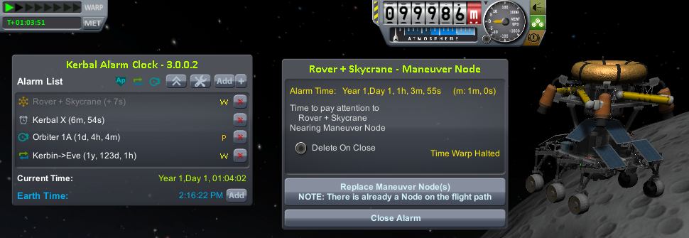

# KerbalAlarmClock /L Unofficial

A management and utility plugin for [Kerbal Space Program](https://www.kerbalspaceprogram.com/).  Unofficial Fork by Lisias.

## In a Hurry

* [Latest Release](https://github.com/net-lisias-kspu/KerbalAlarmClock/releases)
    + [Binaries](https://github.com/net-lisias-kspu/KerbalAlarmClock/tree/Archive)
* [Source](https://github.com/net-lisias-kspu/KerbalAlarmClock)
* [Change Log](./CHANGE_LOG.md)

## Description

The Kerbal Alarm Clock is a plugin that allows you to create reminder alarms at future periods to help you manage your flights and not warp past important times, preventing those moments where Jeb looks at you in the little window and thinks "There goes that manuever node, Looks like you didn't press `,` enough Boss"

The Kerbal Alarm Clock is a plugin that allows you to create reminder alarms at future periods to help you manage your flights and not warp past important times.

With the Kerbal Alarm Clock you can create alarms for the following situations:

|                                 |                    |     |
|:-------------------------------:|:------------------:|-----|
| 	 | Raw Time Alarm | Created for either a specific date/time or a specific period in the future |
|  | Maneuver Node  | Create an alarm based on the next maneuver node on the current ships flight path. This node will be stored and can be restored when you come back to the ship |
|   | Apoapsis / Periapsis	| create an alarm for nearest and furthest part of the orbit from the planet |
|   | Ascending Node / Descending Node | Ascending/Descending Node for the targeted object, or equatorial Ascending/Descending Node |
|  | 	Closest Approach | Create an alarm based on the closest Approach of this Vessel to the targetted Vessel. Select how many orbits into the future to look for the closest approach |
|  | Target Distance | Create an alarm based on distance to a target vessel or altitude from the orbited (or next patch) planet |
|  | Launch Rendezvous | Alarm that can be set to fire as your landed craft passes under the orbit of your target |
|  | Sphere of Influence | Create an alarm manually based on when the next SOI point is on the flight path, or set the alarm clock to continually monitor the active flight path and add alarms as it detects SOI changes |
|  | Planetary Transfer | Create an alarm based on Interplanetary Transfer Phase Angles ie. When should I launch to planet X Based on Kosmo Not's post and used in Olex's Calculator |
|  | Earth Time | Create an alarm based on the time in the "Earth" alternative Universe (aka the Real World) |
|                                  | Contracts | Create an alarm based on the Expiry or deadline of contracts in career modes |
 
For all alarms you can give them :

* A short name to show in the list;
* Some more detailed message information;
* An action to take when the alarm is reached - message only, cancel time warp or pause the game;
* Play distinct sounds for each type of alarm;
* For Event alarms, eg Maneuever's, SOI events, etc. you can also set a margin - ie. How long before the event should the alarm fire;Set the alarms to kill the warp rate in the game so you don't go flying past them, or to pause the game so you can be AFK;

Other useful features/notes are:

* Some Alarms can be repeated;
* Edit the details of the alarm up until the point when it fires;
* Jump back to the ship that the alarm is related to when it fires;
* In map view you can "Warp To" nodes on the flight path;
* Save and Restore Maneuver Node Lists and Targets associated with Alarms;
* No need to add a part to any vessel;
* Time will slow and Halt in Space Center and Tracking Station Screens;
* Add subset of alarms in Space Center and Tracking Station Screens;
* Ability to jump to ship from Space Center and Tracking Station Screens;
* Ability to Archive Saves on Ship Jumping;

Please refer to the [Original Author's page](https://triggerau.github.io/KerbalAlarmClock/) for more information! Plenty of useful information there!

## Installation

Detailed installation instructions are now on its own file (see the [In a Hurry](#in-a-hurry) section) and on the distribution file.

### License:

Released under MIT license. See [here](./LICENSE).

Please note the copyrights and trademarks in [NOTICE](./NOTICE).

## UPSTREAM

* [TriggerAU](https://forum.kerbalspaceprogram.com/index.php?/profile/57838-triggerau/)
	+ [Forum](https://forum.kerbalspaceprogram.com/index.php?/topic/22809-*)
	+ [CurseForge](https://www.curseforge.com/kerbal/ksp-mods/kerbal-alarm-clock)
	+ [SpaceDock](http://spacedock.info/mod/699/Kerbal%20Alarm%20Clock)
	+ [GitHub](https://github.com/TriggerAu/KerbalAlarmClock/)
	+ [HomePage](https://triggerau.github.io/KerbalAlarmClock/)
